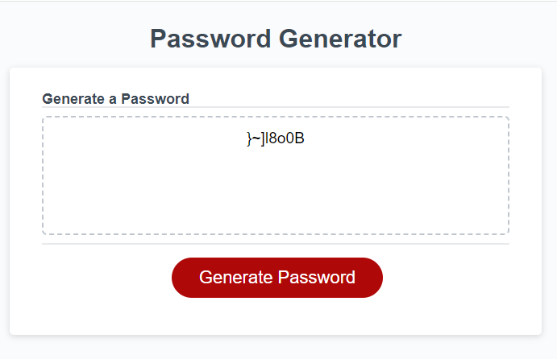

# Password Generator page

## Description

This password generator page was created as a tool to generate a random password based on criteria user have. It is a webpage consist of HTML, CSS, JS.

## Screenshot

## Usage

To view this webpage please follow the link https://dinhn17.github.io/password-generator/
Step 1: Click on Generate Password button.
Step 2: Choose the criteria for generating the password.
        - The length should be between 8 and 128 characters.
        - Choose at least one type of character (lowercase, uppercase, numberic and/or special characters) by clicking on OK button.
Step 3: The random generated password will be displayed on the page.

## Credits

This webpage uses the password special characters from https://owasp.org/www-community/password-special-characters.

## License

Please refer to the LICENSE in the repo.
